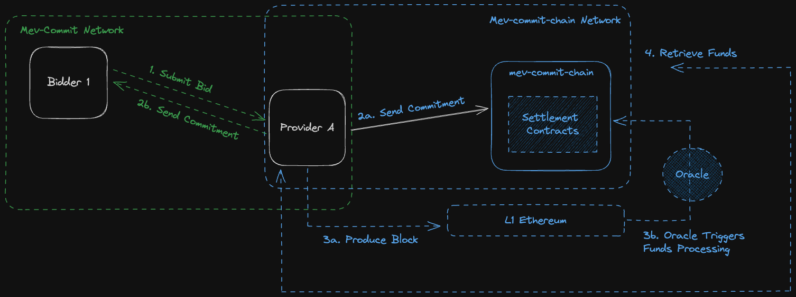

# mev-commit

## Introduction
mev-commit is peer-to-peer (P2P) networking software that serves as a conduit for real-time communication with execution providers. mev-commit enables mev actors to join and utilize a P2P network for the exchange of execution bids and commitments, enriching the transaction execution experience by allowing for granular specification of execution needs and receiving real-time credible commitments.

## Actors

Network actors' roles are defined based on their interactions with other ecosystem actors. A diagram below depicts a given mev actor's relative placement compared to others. For example, a Searcher is a bidder for a Sequencer; but that same Sequencer can be a bidder for a block builder. Thus it's best to think of actors' roles in mev-commit similar to their roles in the mev pipeline. To the left of the diagram are bidders, and to the right of the diagram are execution providers who can issue commitments against these bids.

Under PBS, information only moves to the right amongst actors in the mev pipeline. With mev-commit, credible commitments for execution that share bits of information flow from providers back to bidders, who consume blockspace.

**Providers**

Providers of execution services, such as **Block Builders and Rollup Sequencers**.

**Bidders**

Users bidding for execution services include **mev searchers, AA bundlers, solvers, Rollup Provers, and others seeking efficient use of block space**.

## Network Topology

Mev-commit's p2p network is structured to allow real-time communication across network actors:

**Connections:** Users and providers are interconnected, with each node initially accessing a primary network node (bootnode) for startup.
**Gateway Nodes:** Providers can set up gateway nodes, allowing bid submissions to their mev-commit RPC endpoint first. These bids will also be gossiped amongst providers.

## Bids and Privacy

mev-commit is inherently pseudonymous, allowing any Ethereum address to submit a bid for the execution of any transaction, including bids for transactions that belong to others. Bids are visible to providers on the network and are identifiable by transaction hashes. Bids get processed by network providers and mev-commit chain nodes for verifiable commitments and seamless reward settlement. mev-commit will develop bid privacy with stronger cryptographic guarantees over time.

## Commitments and Privacy

Commitments are signatures from providers accepting bids. mev-commit offers standard and privacy-preserving commitment methods for providers to choose from. Privacy-preserving commitments safeguard the confidentiality of commitment details, letting only the bidder know their bid is committed to during the block slot, and revealing the full details for the network after the slot concludes. mev-commit will have privacy preserving commitments in a subsequent release during the testnet phase.

You can read more about how mev-commit enables execution commitment privacy [here](https://mirror.xyz/0xB456F9deb9bB6f545f91Ce2949C458c3A723659e/1gjUCw9tCUDZ2U71N-6IkINeJYyhuTdC7WeVeBam-fM).
 
## mev-commit chain

Bids and commitments will settle on a specialized EVM sidechain ran with go-ethereum’s Clique proof-of-authoriy (POA) consensus mechanism. Initially operated by Primev entities, the mev-commit chain handles fund settlements, rewards, and slashing. Over time we plan to authorize entities from around the MEV ecosystem to join the POA block signer set. The end goal is to enable a federated mev-commit chain where various actors from the system are assuming the block producer role in turns. Note the mev-commit chain is entirely separate from the Ethereum mainnet blockspace, and is optimized for significantly higher throughput.

For more information, see [mev-commit chain details](mev-commit-chain.md).

## Network Flows

The diagram below illustrates how **bids, commitments, and funds** flow with mev-commit, reflecting its efficiency in facilitating P2P interactions for mev actors.

